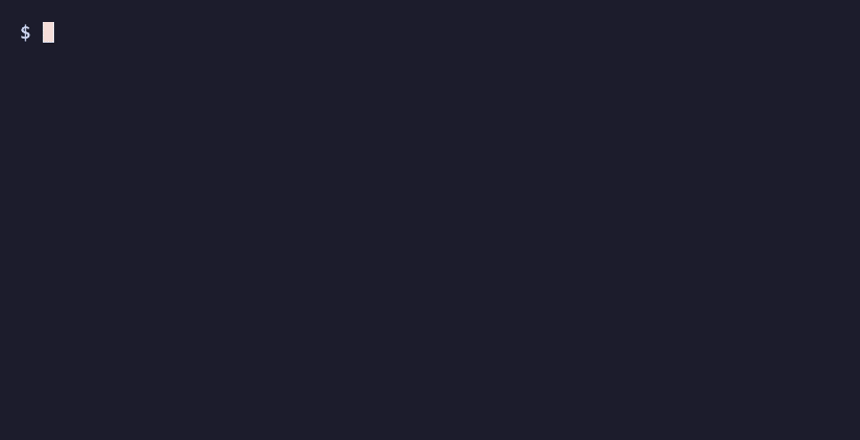

<div align="center">

<br>

# local-llm-setup

**Zero to a running local LLM — in one command.**

<sub>… then build whole apps from a chat box — clone any site, search the web, ask your own docs by sight — **all 100% on your machine. No API keys, ever.**</sub>

<sub>macOS&nbsp; · &nbsp;Linux&nbsp; · &nbsp;Windows&nbsp; · &nbsp;no prior knowledge required</sub>

<br>

[](https://github.com/hamza-ali-shahjahan/local-llm-setup/actions/workflows/shellcheck.yml) [](https://github.com/hamza-ali-shahjahan/local-llm-setup/actions/workflows/linux-smoke.yml) [](https://github.com/hamza-ali-shahjahan/local-llm-setup/actions/workflows/windows-smoke.yml) [](LICENSE) 

<br>
<br>



<br>

<sub><em>One command reads your hardware and proposes a model plan that fits — shown here as a <code>--dry-run</code>, so nothing is installed or downloaded. Left is a real macOS/Linux run; right is an experimental, not-yet-verified Windows preview.</em></sub>

<br>

</div>

<!-- Hero visual above is a side-by-side of two terminal panes: a REAL macOS/Linux run of
     ./local-llm-setup.sh --dry-run (left) and a SCRIPTED Windows PowerShell preview (right,
     assets/win-sim.sh). Rebuild with `bash assets/build-demo.sh` (needs vhs + ffmpeg). -->

---

Setting up a local AI model the normal way takes **a dozen manual steps and a pile of decisions**: which runtime, which model, will it fit your RAM, what "quantization" means, how to set a context window, how to test it. Miss one and you're stuck.

This collapses all of it into **one command that asks you nothing it can figure out for itself** — and you don't need to know what any of it means. It checks you have the disk space before downloading, sizes the model to your GPU when you have one, and — the moment it's done — offers to open a chat in your browser and set up AI in your editor.

### From 12 steps to 1

| Setting it up by hand | This script |
| --- | --- |
| 1. Research runtimes (Ollama? LM Studio? llama.cpp?) | ✅ handled |
| 2. Install and configure one | ✅ handled |
| 3. Check how much RAM you have | ✅ auto-detected |
| 4. Work out which model size fits | ✅ auto-picked |
| 5. Learn what "quantization" is | ✅ not your problem |
| 6. Choose a quant level (Q4? Q5?) | ✅ chosen for you |
| 7. Find the exact model tag | ✅ handled |
| 8. Download the model | ✅ handled |
| 9. Figure out the context window | ✅ handled |
| 10. Configure it without blowing up RAM | ✅ tuned for your RAM |
| 11. Start the runtime | ✅ handled |
| 12. Test that it actually works | ✅ live smoke test |

**12 steps and 5+ judgment calls → 1 command, 0 required decisions.** Built for someone doing this for the very first time — no prior knowledge assumed.

## Why

Cloud AI tools can change their rules overnight. Running a capable model on your own machine is cheap insurance — and these days a modern Mac, Linux, or Windows box runs genuinely useful models locally. The hard part has always been the first 30 minutes of setup. This removes them.

---

## Quick Start

**Find your machine below and jump straight to its one command — that's the whole setup.**

### ➡️ &nbsp; [🍎 macOS / 🐧 Linux](#-macos--linux) &nbsp;·&nbsp; [🪟 Windows ⚠️ *experimental*](#-windows)

> **macOS / Linux is the tested, primary path.** The Windows one-command exists but is **⚠️ experimental — not yet tested on a real Windows machine** (see the note in the [Windows section](#-windows) below).

> These commands run in your computer's built-in command app (**Terminal** on Mac/Linux, **PowerShell** on Windows) — **not** in a web browser, ChatGPT, Claude, or an IDE search box. Each section below tells you exactly which app to open and where to find it.

---

## 🍎🐧 macOS / Linux

### The one command

Paste this into your **Terminal** and press Return. It downloads the script next to you and runs it — checking your machine, installing the runtime, pulling the right model, and smoke-testing it. **It asks before installing anything.**

```bash
curl -fsSL https://raw.githubusercontent.com/hamza-ali-shahjahan/local-llm-setup/main/local-llm-setup.sh -o local-llm-setup.sh && bash local-llm-setup.sh
```

**New to the Terminal? Here's how to open it:**

- **Mac:** press **⌘ Command + Spacebar**, type **`Terminal`**, press **Return**.
- **Linux:** open your apps menu and search **`Terminal`** (on most desktops **Ctrl + Alt + T** opens it directly).

A window opens with a prompt ending in `%` or `$` and a blinking cursor — that's it waiting for you. To paste the command: **⌘ Command + V** (Mac) or **Ctrl + Shift + V** (Linux), then press Return.

<details>
<summary><b>Rather see the full plan first, without changing anything?</b></summary>

This downloads the script and prints exactly what it *would* do — no installs, no downloads, nothing touched:

```bash
curl -fsSL https://raw.githubusercontent.com/hamza-ali-shahjahan/local-llm-setup/main/local-llm-setup.sh -o local-llm-setup.sh && bash local-llm-setup.sh --dry-run
```
</details>

<details>
<summary><b>Rather read the script line by line before running it? (encouraged)</b></summary>

```bash
# 1. Download it
curl -fsSL https://raw.githubusercontent.com/hamza-ali-shahjahan/local-llm-setup/main/local-llm-setup.sh -o local-llm-setup.sh

# 2. Read it (press q to quit)
less local-llm-setup.sh

# 3. Run it
bash local-llm-setup.sh
```
</details>

### What it does

```
==> Checking your machine
✓ Platform: mac
✓ Chip: Apple M5 Pro
✓ Memory: 24 GB

==> Recommended setup
  Tier:     14b  (sized to your 24 GB of memory)
  Models:   qwen2.5-coder:14b deepseek-r1:14b
  Context:  8192 tokens  (keeps memory use sane)
  Download: ~19 GB  (you have 669 GB free)
```

It then checks you have the disk space, installs Ollama, pulls those models, bakes the context window into ready-to-use `*-8k` variants, runs a live smoke test, and offers to open a browser chat + set up your editor. On a Linux box with an NVIDIA GPU you'll also see a `✓ GPU:` line, and the tier is sized to your VRAM instead.

### What it installs

| Component | What it is | Why |
| --- | --- | --- |
| [Homebrew](https://brew.sh) | Mac package manager | **macOS only**, and only if you don't have it (asks first) |
| [Ollama](https://ollama.com) | Local model runtime | Runs the models. Installed via Homebrew (macOS) or the official `ollama.com/install.sh` (Linux) |
| 1–2 models | Coder + reasoning | Chosen automatically from your hardware |

Nothing is hidden and nothing is destructive. Every install asks for confirmation; `--dry-run` shows the full plan without touching your system.

---

## 🪟 Windows

> ⚠️ **Experimental — not yet tested on a real Windows machine.** The PowerShell installer is provided as-is; please [report issues](https://github.com/hamza-ali-shahjahan/local-llm-setup/issues). The macOS / Linux path above is the tested, primary one — if you're on Windows and something breaks, your reports are what will make this path solid.

Windows has its own one command, [`local-llm-setup.ps1`](local-llm-setup.ps1). It's **designed to** run Ollama **natively**, so your GPU is used for real — no WSL, no virtual machine.

### The one command

Paste this into **PowerShell** and press Enter. It downloads the script, allows it to run **for this window only** (Windows blocks downloaded scripts by default), and runs it. **It asks before installing anything.**

```powershell
Invoke-WebRequest -Uri https://raw.githubusercontent.com/hamza-ali-shahjahan/local-llm-setup/main/local-llm-setup.ps1 -OutFile local-llm-setup.ps1; Set-ExecutionPolicy -Scope Process -ExecutionPolicy Bypass -Force; .\local-llm-setup.ps1
```

**New to PowerShell? Here's how to open it:**

Click **Start**, type **`PowerShell`**, and click **Windows PowerShell**. A blue window opens with a prompt ending in `>`. To paste the command: **Ctrl + V** (or right-click the window), then press Enter.

> If `winget` isn't on your machine, the script downloads the official Ollama installer instead and runs it for you — either way you don't have to find anything yourself.

<details>
<summary><b>Rather see the full plan first, without changing anything?</b></summary>

```powershell
Invoke-WebRequest -Uri https://raw.githubusercontent.com/hamza-ali-shahjahan/local-llm-setup/main/local-llm-setup.ps1 -OutFile local-llm-setup.ps1; Set-ExecutionPolicy -Scope Process -ExecutionPolicy Bypass -Force; .\local-llm-setup.ps1 -DryRun
```
</details>

<details>
<summary><b>Rather read the script before running it? (encouraged)</b></summary>

```powershell
# 1. Download it
Invoke-WebRequest -Uri https://raw.githubusercontent.com/hamza-ali-shahjahan/local-llm-setup/main/local-llm-setup.ps1 -OutFile local-llm-setup.ps1

# 2. Read it (opens in Notepad)
notepad local-llm-setup.ps1

# 3. Allow this one script to run for the current window, then run it
Set-ExecutionPolicy -Scope Process -ExecutionPolicy Bypass
.\local-llm-setup.ps1
```
</details>

### What it does

```
==> Checking your machine
[ok] Platform: windows
[ok] Chip: AMD Ryzen 7 7800X3D
[ok] Memory: 32 GB
[ok] GPU: NVIDIA GeForce RTX 4070 (12 GB VRAM)

==> Recommended setup
  Tier:     14b  (sized to your 12 GB GPU — the fast path)
  Models:   qwen2.5-coder:14b deepseek-r1:14b
  Context:  8192 tokens  (keeps memory use sane)
  Download: ~19 GB  (you have 400 GB free)
```

It then checks you have the disk space, installs Ollama **natively** (via `winget`, or the official installer if `winget` isn't present), starts the Ollama service on `localhost:11434`, pulls those models, bakes the context window into ready-to-use `*-8k` variants, runs a live smoke test, and offers to open a browser chat + set up your editor. With a discrete NVIDIA GPU you'll see a `[ok] GPU:` line (detected via `nvidia-smi`), the GPU is used for real — no WSL — and the tier is sized to your VRAM instead of system RAM.

### What it installs

| Component | What it is | Why |
| --- | --- | --- |
| [Ollama](https://ollama.com) | Local model runtime | Runs the models **natively** via `winget` (`Ollama.Ollama`), or the official `OllamaSetup.exe` from ollama.com if `winget` is absent. No WSL — your GPU is used for real |
| 1–2 models | Coder + reasoning | Chosen automatically from your hardware (VRAM if you have an NVIDIA GPU, else RAM) |
| `*-8k` context variants | Ready-to-use models | Baked locally with `ollama create` so the context window is pre-set |

Nothing is hidden and nothing is destructive. Every install asks for confirmation; `-DryRun` shows the full plan without touching your system. (Python is **not** installed — it's optional, and only used to auto-serve the browser chat and the `-Agent` tools if you already have it.)

> **Got an NVIDIA GPU?** To confirm it's really using the GPU, follow [docs/verify-windows-gpu.md](docs/verify-windows-gpu.md) — a ~5-minute check.

---

## How models are matched to your machine

The tier is sized to whatever will actually run the model well:

- **Got a discrete NVIDIA GPU?** The model lives in its VRAM, so the script sizes to your **VRAM** — the fast path. (Detected on Linux and Windows via `nvidia-smi`.)
- **No GPU** (or Apple silicon, where memory is unified)? It sizes to **system RAM**, leaving the ~4–8 GB of headroom your OS needs.

| Your VRAM / RAM | Tier | Models pulled | Runs like | Download |
| --- | --- | --- | --- | --- |
| ≤ 16 GB | `7b` | `qwen2.5-coder:7b`, `deepseek-r1:7b` | Fast on almost anything | ~10 GB |
| 17–32 GB | `14b` | `qwen2.5-coder:14b`, `deepseek-r1:14b` | The sweet spot | ~19 GB |
| 33–64 GB | `32b` | `qwen2.5-coder:32b`, `deepseek-r1:32b` | Noticeably smarter | ~40 GB |
| 65 GB+ | `70b` | `qwen2.5-coder:32b`, `deepseek-r1:70b` | Workstation-class | ~63 GB |

(GPU sizing uses VRAM bands of ≤8 / ≤16 / ≤32 / >32 GB.) Before downloading, the script checks you have the disk space and **stops early** if you don't — no failing halfway through a 40 GB pull. Override the auto-pick with `--tier 7b|14b|32b|70b` (`-Tier` on Windows).

## Flags

macOS / Linux use `--flag`; Windows PowerShell uses `-Flag`. Same behavior either way.

| macOS / Linux | Windows | Effect |
| --- | --- | --- |
| `--dry-run` | `-DryRun` | Print the full plan; change nothing |
| `--yes`, `-y` | `-Yes` | Accept all defaults, no prompts (unattended) |
| `--tier <t>` | `-Tier <t>` | Force a model tier (`7b`, `14b`, `32b`, `70b`) |
| `--lean` | `-Lean` | Also bake a minimal-code "ponytail" coder variant (see below) |
| `--chat` | `-Chat` | Open the local app **builder** in your browser (chat + live preview) |
| `--editor` | `-Editor` | Set up Continue in VS Code / Cursor for your local models |
| `--agent` | `-Agent` | Builder **+ approve-to-run tools** (runs commands you OK; opt-in, needs Python) |
| `--benchmark` | `-Benchmark` | Measure tokens/sec for every installed model |
| `--uninstall` | `-Uninstall` | Remove the models this tool installs (asks first) |
| `--platform <os>` | — | Override OS auto-detect (`mac`, `linux`) |
| `--version` | `-Version` | Print the version and exit |
| `--help`, `-h` | `-Help` | Show usage |

## Lean coder (ponytail) — optional `--lean`

Pass `--lean` (`-Lean` on Windows) and the script bakes an extra coder variant — `qwen2.5-coder-14b-lean` — with a "write the minimum code" system prompt. It walks the model down a ladder before it writes anything: *does this need to exist? → standard library? → platform feature? → can it be one line? → only then, minimal code.*

This matters most **on a local model**: less generated code means fewer output tokens, faster responses, and more room in your tight context window. In a side-by-side on the same prompt, the lean variant wrote **~45% fewer lines** than the plain model — and cleaner code.

```bash
ollama run qwen2.5-coder-14b-lean     # the minimal-code coder
```

The system prompt is adapted from [ponytail](https://github.com/DietrichGebert/ponytail) (MIT) — *"the best code is the code you never wrote."*

## Use it: a builder, your editor, and (optionally) tools

Running the model is only half of "useful". When setup finishes it **offers to set these up for you** — or run them anytime.

**💬 Build apps in your browser** — a local, Lovable-style **app builder**: chat on the left, a **live preview** on the right.

```bash
./local-llm-setup.sh --chat          # -Chat on Windows
```

Ask it to *"build me a stopwatch"* and it renders + runs in a sandboxed iframe (with a **Code** tab, **Download**, and **🚀 Deploy** — one click serves it on a real local URL in its own tab, no cloud). It works with **any code-writing model** — a builder prompt makes the model emit one self-contained HTML file. Also: a **history sidebar** (past builds) and Claude-Code-style scroll (scroll up mid-generation without getting yanked down). Served from `localhost`, which Ollama allows by default, so the page can reach your model but Ollama is **not** exposed to the web.

Under the hood it works like the tools that inspired it: it **picks the right model for each request** (⚡ Auto — a coder to build, a reasoner to explain), **plans before it builds**, **fixes its own runtime errors**, shows the work as **traceable tasks** (not raw code scrolling past), and keeps each chat as its own isolated project. With **agent mode** on it can also **clone a real website** — inspect its live palette, fonts and layout, rebuild it, then **score** how close the result is — and **search the web** (keyless, no API key) when it needs a fact, doc or reference. See [how that compares to Claude Code and Lovable](#how-we-compare--and-where-were-honestly-behind) below.

With **🎯 Goal Mode** on, it goes a step further: it **forges a measurable goal** from your ask (an exact metric + target, numeric evals, a feasibility check), **waits for you to Agree**, then **pursues** it — building, scoring and iterating toward the target — and reports an **honest verdict** (reached, or the ceiling it hit and the lever that would raise it), logging what it learns to `~/.local-llm-setup/goal_runs.jsonl`. It never fakes a number — goals with no automatic scorer are flagged *by inspection* and just build.

**🧩 AI inside your editor** — installs [Continue](https://continue.dev) in VS Code / Cursor and points it at your local models:

```bash
./local-llm-setup.sh --editor        # -Editor on Windows
```

Then open your editor → the Continue icon in the sidebar → pick a "(local)" model. Chat, edit, and "apply" all run on your machine.

**🤖 Agent mode (opt-in)** — adds **real, approve-to-run tools**: the model can run shell commands and write files, so it can build multi-file things, not just single-page apps.

```bash
./local-llm-setup.sh --agent         # -Agent on Windows  (needs Python)
```

Every action waits for you to click **Approve**, and everything happens inside a workspace folder (`~/.local-llm-setup/workspace`), on `localhost` only. It's **off by default and consented** because an approved command runs with your full permissions — see the safety notes in [CHANGELOG.md](CHANGELOG.md).

## How we compare — and where we're honestly behind

This project exists to bring **[Claude Code](https://www.anthropic.com/claude-code)**- and **[Lovable](https://lovable.dev)**-style building to a **100% local, free, private** stack. We are **not at parity yet** — and the honest thing is to show exactly where. **Every ❌ below is a public to-do, not a secret, and we're committed to closing them.**

What you trade that gap *for*: it runs entirely on your machine, costs nothing, works offline, and your code never leaves the building.

| Tool capability | **local-llm-setup** | Claude Code | Lovable |
|---|:---:|:---:|:---:|
| **Runs 100% local & offline** | ✅ | ❌ | ❌ |
| **Free — no subscription** | ✅ | ❌ | ❌ |
| **Your code never leaves your machine** | ✅ | ❌ | ❌ |
| Build & edit code | ✅ | ✅ | ✅ |
| Live preview | ✅ | ✅ | ✅ |
| Plan before building | ✅ | ✅ | ✅ |
| Run commands / terminal | ✅ | ✅ | ⚠️ |
| Read / write files | ✅ | ✅ | ✅ |
| Self-repair runtime errors | ✅ | ✅ | ✅ |
| Self-correcting "owns its mistakes" voice | ✅ | ✅ | ⚠️ |
| Fetch & inspect a web page | ✅ | ✅ | ✅ |
| Extract a site's palette & fonts | ✅ | ✅ | ✅ |
| **Clone a real website** | ✅ | ✅ | ✅ |
| Auto-pick the model per request | ✅ ⚡ | ❌ | ❌ |
| **Goal-driven build** — forge → agree → pursue → log | ✅ 🎯 | ⚠️ | ❌ |
| Screenshot a page | ✅ | ✅ | ✅ |
| Visual / fidelity self-check | ✅ <sup>§</sup> | ✅ | ✅ |
| **Web search** | ✅ <sup>‡</sup> | ✅ | ⚠️ |
| Image generation | ❌ | ⚠️ | ✅ |
| Multi-file projects | ❌ | ✅ | ✅ |
| **Backend / database** / auth | ⚠️ <sup>◆</sup> | ⚠️ | ✅ |
| **One-click deploy** | ✅ <sup>¶</sup> | ✅ | ✅ |
| Git / repo sync | ✅ <sup>†</sup> | ✅ | ✅ |
| **Connect MCP servers (tools)** | ✅ | ✅ | ❌ |

<sub>✅ have it · ⚠️ partial, best-effort, or a different approach · ❌ not yet — building toward it</sub>

**Where we're behind, and committed to closing:** multi-file projects, image generation, and full backend logic + auth. And one honest note on how the visual self-check works:

- **The visual self-check has two tiers.** The always-on score is _structural_ — palette, fonts, sections and design tokens vs the real page, the most *actionable* signal for a code model. Install the optional local **vision model** and clones also get a real **visual** pass: it screenshots your clone beside the original, scores how visually close it is (0–100) and names concrete gaps that drive the next fix. It's a local 7B — meaningfully closer, honestly not pixel-perfect parity.

<sub>**†&nbsp;Git sync is local-only.** We initialise a real git repo, write a sensible `.gitignore`, commit, and export a `.zip` that includes the full `.git` history. **Pushing to a remote (e.g. GitHub) is not automated** — that needs your own credentials, so the tool prints the exact `git push` command for you to run rather than running it for you. Screenshots are Playwright-backed (managed Chromium) with a system-Chrome fallback.</sub>

<sub>**‡&nbsp;Web search is keyless.** In agent mode the builder can `<search>` the live web with **no API key** — by default via DuckDuckGo's HTML endpoint, returning the top results as title + URL + snippet so the model can then `<fetch>`/`<inspect>` the most relevant page. Want it fully on your own box too? Point `LLM_SEARCH_URL` at a self-hosted [SearXNG](https://github.com/searxng/searxng) and search never leaves your network either. Like fetching a page, the query itself needs a connection — but never a cloud key.</sub>

<sub>**§&nbsp;Visual self-check is two-tier.** Structural token-scoring runs always; a real **visual** pass (screenshot the clone beside the original → a visual-closeness score 0–100 + a concrete gap list → drives the next fix) turns on when you install the optional local vision model (`qwen2.5vl:7b`, one click in 🧩 Capabilities). It's a local 7B — meaningfully closer, not pixel-perfect. See [docs/vision-model.md](docs/vision-model.md).</sub>

<sub>**¶&nbsp;Deploy is local-first.** One click serves your built app on a real `http://` URL on your machine — a standalone page in its own browser tab (a real origin, so relative paths, `fetch` and service workers work) that **keeps running after you close the builder**. Localhost by default; opt into `0.0.0.0` to reach it from your phone on the same Wi-Fi. A public cloud URL still needs your own host — by design we never ship cloud keys, so the keyless, private local URL is the finish line.</sub>

<sub>**◆&nbsp;A real local database for deployed apps.** When you 🚀 deploy an app it also gets a **zero-setup JSON data store** at a same-origin REST API — `GET`/`POST /api/data/<collection>`, `GET`/`PUT`/`DELETE /api/data/<collection>/<id>` — backed by stdlib SQLite, stored beside the app (never in the web root) with no CORS and no config. So a todo list, notes app or guestbook actually **remembers** across visits. Still ❌: arbitrary server-side logic and auth.</sub>

The roadmap toward parity lives in [`docs/PRD-local-builder-v2-tools-and-goals.md`](docs/PRD-local-builder-v2-tools-and-goals.md). **Issues and PRs that turn a ❌ into a ✅ are exactly what this project is for.**

## After setup

```bash
ollama run qwen2.5-coder-14b-8k       # chat with your context-tuned model in the terminal
ollama list                           # see everything you have
./local-llm-setup.sh --benchmark      # how fast is each model? (tokens/sec)
```

Point any OpenAI-compatible app, IDE, or agent at it directly:

- **Base URL:** `http://localhost:11434/v1`
- **API key:** `ollama` (any non-empty string works)
- **Model:** the tag from `ollama list`

Done experimenting? `./local-llm-setup.sh --uninstall` (or `-Uninstall`) removes the models this tool added, and can remove Ollama itself — both ask first.

## Vision model — sharper website cloning (optional)

By default the builder clones a page *structurally* (palette, fonts, sections, copy) — accurate but blind to pixels. Install a local vision model and clones get a **visual-critique pass**: it screenshots your clone next to the original and feeds concrete fixes (layout, spacing, colour, type) back to the coder.

- **Enable it:** open **🧩 Capabilities** in the builder → **Install vision model**, or run `ollama pull qwen2.5vl:7b`.
- **Cost:** ~6 GB disk, ~24 GB RAM to run alongside the coder (it swaps models per round, so clones get slower). It's a local 7B model — meaningfully closer, not pixel-perfect.

Full details, requirements, and the implementation gotchas (the Ollama context-window trap especially): **[docs/vision-model.md](docs/vision-model.md)**.

## Ask your own docs by sight — 📚 Visual RAG (optional)

Add a page by URL or drop in an image (a slide, a chart, a scanned page) and the builder **screenshots it, has the local vision model describe what it *looks like*, embeds that, and indexes it.** Then ask a question and it retrieves the most visually-relevant pages and answers from their **pixels** — so the tables, charts and layout that plain text extraction throws away stay searchable.

Fully local and dependency-free: `qwen2.5vl` + `nomic-embed-text` via Ollama, a stdlib SQLite store and pure-Python cosine — no PyTorch, FAISS or numpy. Open **📚 Knowledge** in the builder (it lights up once the vision + embedding models are installed — one click each in **🧩 Capabilities**). Inspired by [PixelRAG](https://github.com/StarTrail-org/PixelRAG), kept on the one-command stack.

## Connect MCP servers — 🔌 (optional)

In **agent mode** the builder can use tools from any [**MCP**](https://modelcontextprotocol.io) server — filesystem, git, web search, a database, or your own — the same open standard Claude speaks. Drop a **Claude-Desktop-compatible** config at `~/.local-llm-setup/mcp.json`:

```json
{
  "mcpServers": {
    "filesystem": { "command": "npx", "args": ["-y", "@modelcontextprotocol/server-filesystem", "/path/you/allow"] }
  }
}
```

The agent connects on startup, lists each server's tools in its own prompt, and calls them with `<mcp server="filesystem" tool="read_file">{ "path": "notes.md" }</mcp>` — **each call asks your approval first** (MCP tools can have side effects). The client is stdlib-only (newline-delimited JSON-RPC 2.0 over the server's stdio); nothing leaves your machine but whatever the server you chose does. This is **MCP parity with Claude Code**, fully local.

## Real apps with a local database — 🗄️ (when you deploy)

Single-page apps usually forget everything on reload. Here they don't have to: **every app you 🚀 deploy gets a zero-setup local database** — a same-origin REST API your app calls with plain `fetch`, no backend code, no config:

```js
await fetch('/api/data/todos')                                                              // list → array
await fetch('/api/data/todos', { method:'POST', body: JSON.stringify({ text:'ship it' }) }) // add → returns it with an id
await fetch('/api/data/todos/3', { method:'PUT', body: JSON.stringify({ done:true }) })      // update
await fetch('/api/data/todos/3', { method:'DELETE' })                                        // remove
```

Backed by stdlib **SQLite**, one database per app, kept **outside** the served files (your app can't fetch the raw `.db`), and same-origin so there's no CORS and nothing exposed. The builder model knows about it — just ask for *"a todo app that saves my todos"* and deploy it. The data lives on your machine. (Still local-only: no auth or arbitrary server logic yet.)

## Requirements

- **macOS** on Apple silicon (M1 or newer recommended), **Linux** (x86-64 or ARM64), or **Windows 10/11** (native — no WSL)
- On Windows, the script uses `winget` if present, otherwise it downloads the official Ollama installer. WSL2 users can run the Bash script with `--platform linux` instead, but native is recommended.
- ~10–65 GB free disk for models, depending on tier (the script checks first)
- An internet connection for the one-time download

## Contributing

Model tags age as new releases ship. PRs that bump the tier list are welcome — it lives in one place in each script: `tier_models()` in [`local-llm-setup.sh`](local-llm-setup.sh) and `Get-TierModels` in [`local-llm-setup.ps1`](local-llm-setup.ps1). Keep the two in lockstep. See [CONTRIBUTING.md](CONTRIBUTING.md).

## License

[MIT](LICENSE) © Hamza Ali Shahjahan
