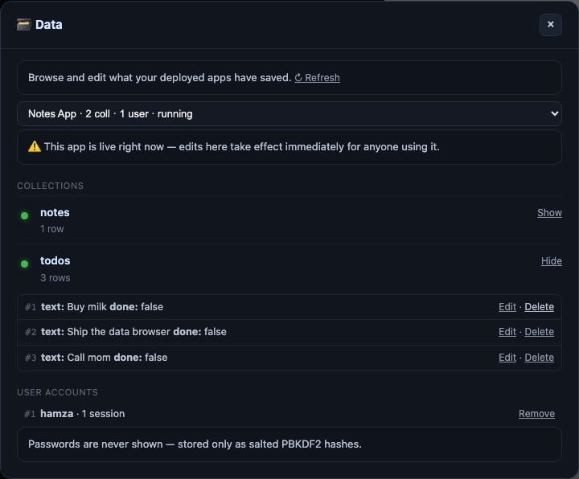

# Backend for deployed apps — local database, auth & the Data panel

The apps you build in the local-llm-setup **builder** are single self-contained pages. The moment you
**🚀 Deploy** one, it also gets a small **local backend** — a real database and real logins — served on
the same origin as the app, backed by stdlib SQLite, with **zero setup and no cloud**. This page is the
reference for app authors and contributors.

> **Scope.** This backend is for **deployed** apps (each runs on its own `http://localhost:<port>` in a
> real browser tab). It is **not** available in the builder's live *preview* — that iframe is sandboxed
> for safety, so it can't make these calls. Build → 🚀 Deploy → the APIs below light up.

---

## 1. Database — `/api/data`

A zero-setup JSON document store. Each **collection** is just a name you choose (`todos`, `notes`,
`scores`…); documents are arbitrary JSON objects and get an auto-incrementing integer `id`.

| Method & path | Does | Returns |
| --- | --- | --- |
| `GET /api/data/<collection>` | list all documents | `{ ok, data: [ { id, … }, … ] }` |
| `POST /api/data/<collection>` | create a document (JSON body) | `201 { ok, data: { id, … } }` |
| `GET /api/data/<collection>/<id>` | read one | `{ ok, data: { id, … } }` |
| `PUT /api/data/<collection>/<id>` | replace one (JSON body) | `{ ok, data: { id, … } }` |
| `DELETE /api/data/<collection>/<id>` | delete one | `{ ok, deleted: true|false }` |

```js
// list
const todos = (await (await fetch('/api/data/todos')).json()).data;

// create — the new doc comes back with its id
const created = (await (await fetch('/api/data/todos', {
  method: 'POST', headers: { 'Content-Type': 'application/json' },
  body: JSON.stringify({ text: 'ship it', done: false }),
})).json()).data;

// update
await fetch('/api/data/todos/' + created.id, {
  method: 'PUT', headers: { 'Content-Type': 'application/json' },
  body: JSON.stringify({ text: 'ship it', done: true }),
});

// delete
await fetch('/api/data/todos/' + created.id, { method: 'DELETE' });
```

Collection names are sanitised to `[A-Za-z0-9_-]`. The store is plain `fetch` + JSON — no client library.

---

## 2. Auth — `/api/auth`

Real accounts and sessions, so an app can be *yours* (or multi-user). No auth service to wire up.

| Method & path | Body | Returns |
| --- | --- | --- |
| `POST /api/auth/signup` | `{ username, password }` | `201 { ok, user: { id, username } }` + sets the session cookie |
| `POST /api/auth/login` | `{ username, password }` | `{ ok, user }` + cookie, or `401 { ok:false, error }` |
| `GET /api/auth/me` | — | `{ ok, user: { id, username } | null }` |
| `POST /api/auth/logout` | — | `{ ok }` + clears the cookie |

```js
async function me() { return (await (await fetch('/api/auth/me')).json()).user; }

await fetch('/api/auth/signup', {
  method: 'POST', headers: { 'Content-Type': 'application/json' },
  body: JSON.stringify({ username, password }),
});                       // a secure session cookie is set automatically

const user = await me();  // { id, username } once signed in, else null
await fetch('/api/auth/logout', { method: 'POST' });
```

`fetch` sends the cookie automatically on same-origin requests, so you never handle the token yourself.

**How it's secured.** Passwords are hashed with **PBKDF2-HMAC-SHA256** (200k iterations) and a per-user
random salt, compared in constant time. The session is a 256-bit random token kept server-side and handed
to the browser in an **`HttpOnly`, `SameSite=Strict`** cookie (JavaScript can't read it; it doesn't ride
cross-site). Removing a user (see the Data panel) **also deletes their sessions**, so their cookie stops
working immediately.

---

## 3. Where the data lives & why it's safe

- **One SQLite database per app**, stored at `~/.local-llm-setup/deploys/<app>.db` — **beside** the
  served folder, never inside it, so a request can never fetch the raw `.db`.
- **Same-origin.** The app and its `/api/data` + `/api/auth` endpoints are served by the *same* local
  server, so there's **no CORS to configure** and nothing is exposed to other sites.
- **Local by default.** The deploy server binds `127.0.0.1`; pass `host: "0.0.0.0"` only if you want to
  reach the app from another device on your Wi-Fi.
- Re-deploying the **same** app reuses its database — your data survives updates to the app.

---

## 4. The 🗄️ Data panel



The builder's **🗄️ Data** button (top-right) opens an admin view over every deployed app's database:

- Pick an app, expand a **collection** to see its rows in a table, **edit** a row's JSON inline, or
  **delete** it (with a confirm).
- Review **user accounts** — id, username, signup date, active sessions — and **remove** one (which
  signs them out everywhere). **Passwords are never shown**; they only exist as salted PBKDF2 hashes.
- Apps are listed from disk, so a **stopped** app's data is still browsable. Opening the panel is
  read-only-safe (it never creates tables), and editing a live app warns you that changes take effect
  immediately.

---

## 5. A complete example — a notes app with logins

Ask the builder for *"a notes app with a login, that saves my notes per user"*, then 🚀 Deploy it. The
generated app will do roughly:

```js
// gate on a session, then scope notes to the signed-in user
const user = (await (await fetch('/api/auth/me')).json()).user;
if (!user) { /* show the login form → POST /api/auth/login or /signup */ }

// load this user's notes
const notes = (await (await fetch('/api/data/notes')).json()).data.filter(n => n.user === user.id);

// add one
await fetch('/api/data/notes', {
  method: 'POST', headers: { 'Content-Type': 'application/json' },
  body: JSON.stringify({ user: user.id, text }),
});
```

The builder's model already knows these APIs, so you usually don't write this by hand — you just ask.

---

## 6. Limits (kept honest)

- **Local-only.** This is your machine's backend, not a hosted one. To put an app on the public internet
  you bring your own host — by design we ship no cloud keys.
- **No arbitrary server-side logic yet.** You get a database + auth, not custom server endpoints or
  business logic. That's the next frontier, deliberately not faked.
- No built-in rate-limiting or email/password-reset flows — it's a local-first backend for building real
  apps quickly, not a production identity provider.

---

## For contributors

It's all stdlib, baked into both installers from the dogfood source of truth via `tools/bake.py`:

- **Store + auth functions** live in `~/.local-llm-setup/agent-server.py` — `data_list/create/get/update/delete`,
  `auth_signup/login/user_by_token/logout`, plus the read-only browse helpers (`_db_apps`, `_db_overview`,
  `data_rows`, `auth_users`, `auth_delete_user`, `_deploy_db`).
- The **deploy server** (`_QuietHTTP`) routes `/api/data/*` and `/api/auth/*` for a deployed app; the
  **agent server** exposes the origin-locked `/api/agent/data/{apps,rows,update,delete,users,userdelete}`
  endpoints behind the Data panel.
- Tests: `tests/test_appdata.py`, `tests/test_appauth.py`, `tests/test_appbrowse.py` (CRUD, the cookie
  flow, path-safety, the no-secrets guarantee, no-phantom-tables, the origin lock) plus browser e2es.
